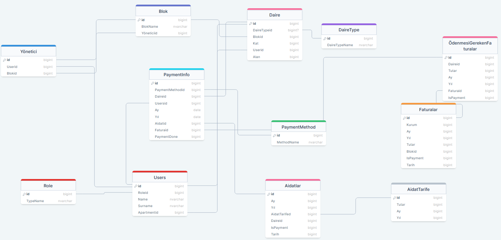
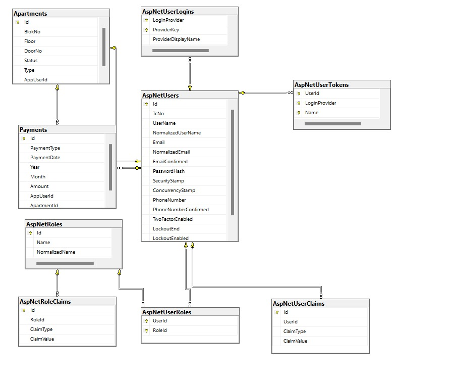

# Apartman Yönetim Sistemi

Bu projenin ne yaptığı ve kimin için olduğu hakkında kısa bir açıklama

## Yapılanlar
- [x] Identity
  - [x] Token oluşturma
  - [x] Kullanıcı/yönetici ekle
  - [x] Rol Ekleme


- [x] Apartments
  - [x] Tüm daire ve apartmanları listele
  - [x] Apartment ve daire bilgileri ekle
  - [x] UserId'ye göre konum bilgileri
  - [x] ApartmentID'ye göre kullanıcı bilgileri
  - [x] Kullanıcı bilgilerini daire için düzenleme


- [x] Payments
    - [x] Ödemeleri listele
    - [x] Ödemeleri ID'ye göre listeleme
    - [x] Ödemeleri güncelle
    - [x] Ödemeleri sil
    - [x] Ödeme ekleme


- [ ] Borçlar
    - [ ] Borçları listele
    - [ ] Borçluları listele - apartman - kullanıcı
    - [ ] Borç güncelle
    - [ ] Borç öde
  

- [ ] Aidatlar
    - [ ] Aidatları listele - düzenli ve geç ödeyenler
    - [ ] Aidat ekle - indirimli aidat durumu 
    - [ ] Aidat güncelle


## DB Yapısı

 ### Kurgusal DB Yapısı -  [drawsql](https://drawsql.app/teams/ezgi/diagrams/ezgi)

 

Yapısı ile kurguya başlasamda, daha sonra bu yapıyı aşağıdaki gibi değiştirdim. 

 ### Yeni DB Yapısı



    

## API Kullanımı

Postman veya benzeri bir araç ile aşağıdaki endpointler kullanılabilir.

collection dosyası: [Export v2.1 --> ApartmentManagementAPI.postman_collection.json](./README_ASSETS/ApartmentManagementAPI.postman_collection.json)

collection dosyası: [Export v2.0 --> ApartmentManagementAPI.postman_collection.json](./README_ASSETS/ApartmentManagementAPI.postman_collection2.0.json)

collection paylaşım linki: [Apartman Yönetim Sistemi](https://dark-star-90151.postman.co/workspace/Management-System~959e5f18-86a1-4dd7-8a68-ac89bc58b88c/collection/30918894-9edd228e-14d3-46e6-9623-f746fc999782?action=share&creator=30918894)

### Identity


#### Create User

```http
  POST /api/identity/CreateUser
```

| Parametre | Tip     | Açıklama                |
| :-------- | :------- | :------------------------- |
| `tcNo` | `string` | **Gerekli**. |
| `phoneNumber` | `string` | **Gerekli**.  |
| `password` | `string` | **Gerekli**. Identity API password validation vardır. |


#### Assign Role

```http
  POST /api/identity/AssignRole
```

| Parametre | Tip     | Açıklama                |
| :-------- | :------- | :------------------------- |
| `userId` | `Guid` | **Gerekli**. |
| `roleName` | `string` | **Gerekli**. DaireSakini veya Yönetici  |


#### Create Token

```http
  POST /api/identity/CreateToken
```

| Parametre | Tip     | Açıklama                |
| :-------- | :------- | :------------------------- |
| `tcNo` | `string` | **Gerekli**. |
| `phoneNumber` | `string` | **Gerekli**.  |
| `password` | `string` | **Gerekli**. Identity API password validation vardır. |

### Apartment


#### Get Apartments

```http
  GET /api/apartment/
```

| Parametre | Tip     | Açıklama                |
| :-------- | :------- | :------------------------- |


#### Add Apartment Info

```http
   POST /api/apartment/
```

| Parametre | Tip     | Açıklama                |
| :-------- | :------- | :------------------------- |
| `id` | `Guid` | **Gerekli**. |
| `blokNo` | `int` | **Gerekli**.   |
| `floor` | `int` | **Gerekli**. |
| `doorNo` | `int` | **Gerekli**. |
| `appUserId` | `Guid` | **Gerekli**. |


#### Get Apartment Info by UserId

```http
  GET /api/apartment/user/{userId}
```

#### Get Apartment Info by ApartmentId

```http
  GET /api/apartment/{id}
```
#### Update Apartment Info by ApartmentId

```http
  POST /api/apartment/{id}
```


| Parametre | Tip     | Açıklama                |
| :-------- | :------- | :------------------------- |
| `id` | `Guid` | **Gerekli**. |
| `blokNo` | `int` | **Gerekli**.   |
| `floor` | `int` | **Gerekli**. |
| `doorNo` | `int` | **Gerekli**. |
| `appUserId` | `Guid` | **Gerekli**. |

### Payment
#### Get All Payments

```http
  GET /api/payment
```
#### Add Payments

```http
  POST /api/payment
```

| Parametre | Tip     | Açıklama                |
| :-------- | :------- | :------------------------- |
| `id` | `Guid` | **Gerekli**. |
| `paymentDate` | `Date` | **Gerekli**.   |
| `amount` | `decimal` | **Gerekli**. |

#### GetById payment

```http
  GET /api/payment/{id}
```
#### Update payment

```http
  PUT /api/payment/{id}
```
| Parametre | Tip     | Açıklama                |
| :-------- | :------- | :------------------------- |
| `id` | `Guid` | **Gerekli**. |
| `paymentDate` | `Date` | **Gerekli**.   |
| `amount` | `decimal` | **Gerekli**. |

#### Delete payment

```http
  DELETE /api/payment/{id}
```


